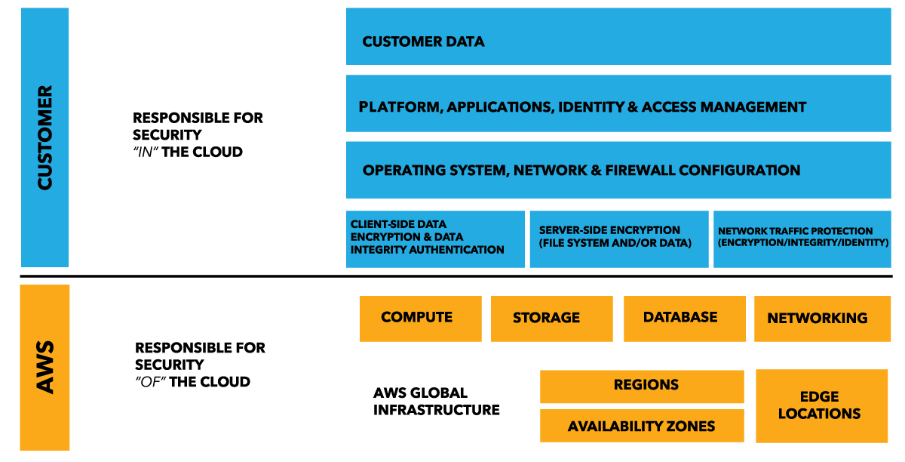
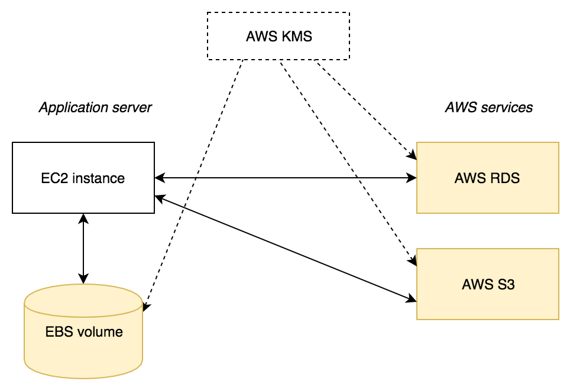

# Infrastructure as a Service (IaaS)

## Amazon Web Services

Subsections:
- [AWS Overview](#aws-overview)
- [AWS Shared Responsibility Model](#aws-shared-responsibility-model)
- [AWS BAA](#aws-baa)
- [AWS Security At Rest](#aws-security-at-rest)

### AWS Overview

__Amazon Web Services (AWS)__ is a secure cloud service provider. It offers vast 
selection of services including computing power, storage, content delivery and 
others to help businesses scale and grow efficiently. 

AWS is [HIPAA compliant](https://aws.amazon.com/compliance/hipaa-compliance/) 
and can be used to process, store and transmit ePHI. This however apply certain 
restrictions on used services and requires specific measures aimed to secure 
your infrastucture. Usage of AWS _does not automatically make your cloud 
infrastructure HIPAA compliant_.

AWS offers subset of their services as __HIPAA eligible__. Usage of other 
services outside of this list is not allowed. Full list is available on their 
[HIPAA Eligible Services 
Reference](https://aws.amazon.com/compliance/hipaa-eligible-services-reference/) 
page. This list is changing over time as AWS adds HIPAA eligibility for more 
services, check AWS reference page to get latest details. 

Currently (at the time of writing) following services are HIPAA eligible:
- Amazon API Gateway excluding the use of Amazon API Gateway caching
- Amazon Aurora [MySQL-compatible edition only]
- Amazon CloudFront [excluding Lambda@Edge]
- Amazon Cognito
- AWS Database Migration Service
- AWS Direct Connect
- AWS Directory Services excluding Simple AD and AD Connector
- Amazon DynamoDB
- Amazon EC2 Container Service (ECS)
- Amazon EC2 Systems Manager
- Amazon Elastic Block Store (Amazon EBS)
- Amazon Elastic Compute Cloud (Amazon EC2)
- Elastic Load Balancing
- Amazon Elastic MapReduce (Amazon EMR)
- Amazon Glacier
- Amazon Inspector
- Amazon Redshift
- Amazon Relational Database Service (Amazon RDS) [MySQL, Oracle, and PostgreSQL 
  engines only]
- AWS Shield [Standard and Advanced]
- Amazon Simple Notification Service (SNS)
- Amazon Simple Queue Service (SQS)
- Amazon Simple Storage Service (Amazon S3) [including S3 Transfer Acceleration]
- AWS Snowball
- Amazon Virtual Private Cloud (VPC)
- AWS Web Application Firewall (WAF)
- Amazon WorkDocs
- Amazon WorkSpaces

_Business Associate Agreement (BAA)_, or _Business Associate Addendum_ (as AWS 
reference it) need to be signed before you can start usage of AWS for your HIPAA 
compliant workloads.

AWS implements _shared responsibility model_ where AWS manages security "of the 
cloud" and leave security "in the cloud" to be managed by the customer.

AWS offers a HIPAA-focused Whitepaper [Architecting for HIPAA Security and 
Compliance on Amazon Web 
Services](https://d0.awsstatic.com/whitepapers/compliance/AWS_HIPAA_Compliance_Whitepaper.pdf):
it has good overview of all HIPAA eligible services and explains how they can be 
used for building systems processing health information.

As a summary, here is a list of __steps to HIPAA compliant AWS infrastructure__:
1. Understand _shared responsibility model_
1. Sign _BAA (Business Associate Addendum)_
1. Use _HIPAA eligible services_ to build your infrastructure
1. Make sure your AWS services _configuration is HIPAA compliant_ (this is 
   customer's part of the shared responsity model) 

### AWS Shared Responsibility Model

AWS implements _shared responsibility model_ where AWS manages security "of the 
cloud" and leaves security "in the cloud" to be managed by the customer. It 
means there are two categories of security measures applied.

- __Security of the cloud:__ security measures that the cloud service provider 
  (AWS) implements and operates

- __Security in the cloud:__ security measures that the customer implements and 
  operates, related to the security of customer content and applications that 
  make use of AWS services

Basically AWS provides infrastrucuture for your applications that _can be used 
in HIPAA compliant way_. But it's your (AWS customer) responsibility to 
_configure cloud infrastructure_ to ensure confidentiality, integrity and 
availability of ePHI. You are also responsible for security of the 
application(s) deployed on top of this HIPAA compliant cloud infrastructure.

Following diagram demostrates this partitioning of responsibility.

AWS as a cloud service provider manages _physical security_ of the following 
components.

- Regions and availability zones
- Edge locations
- Compute resources
- Storage resources
- Databases
- Networks

You as a _customer manage security_ of the following areas.

- Network traffic protection
- Server-side encryption (for storage and databases)
- Data transmission integrity and encryption 
- Data availability
- Disaster recovery
- Access management

All these areas are typically covered by the cloud service provider (AWS) 
offerings but require proper _cloud architecture and configuration_ to be 
implemented by the customer.

Additionally you are responsible for security of components deployed on top of 
your AWS cloud infrastructure.

- Operating systems
- Platforms
- Applications

Understanding of the _shared responsibility model_ is an important step towards 
running your HIPAA application in AWS cloud. You can clearly see the boundaries 
of AWS offering in terms of security and plan your cloud architecture 
accordingly.

### AWS BAA

AWS requires _Business Associate Addendum (BAA)_ to be signed before you can 
start usage of AWS for your HIPAA compliant workloads.

AWS offers [AWS Artifact service](https://aws.amazon.com/artifact/) as 
self-service portal for on-demand access to security compliance reports and 
agreement (only BAA and NDA for now).

__Step 1:__ Accept AWS Artifact NDA.

- Sign in and open _AWS Artifact_ console
- Open _Agreements_ section
- Open _AWS Artifact Nondisclosure Agreement_ subsection
- Click on _Download and review AWS Artifact NDA_ link and read NDA
- Check "I have downloaded, read and agree ..." box
- Click on "Accept ..." button

Final state before clicking the button is shown on the picture below.

__Step 2:__ Accept AWS BAA.

- Open _AWS Business Associate Addendum_ subsection
- Click on _Download and review AWS BAA_ link and review BAA
- Check all 3 boxes
- Click on "Accept ..." button

Final state before clicking the button is shown on the picture below.

Now you can __start usage of your AWS account for HIPAA compliant workloads__. 
AWS requires that when you include PHI in this account, YOU MUST:

1. Use only HIPAA Eligible Services in connection with PHI, and
1. Encrypt all PHI in-transit and at-rest.

This does not restrict usage of this AWS account for data and application not 
covered by HIPAA requirements. However this usually requires specific cloud 
architecture where PHI is strictly separated from non-PHI resources.

AWS BAA can be _terminated at any time_ using AWS Artifact service. This means 
you have to delete all PHI under this account prior to termination, and stop 
further usage of this account in connection with any PHI.

### AWS Security At Rest

AWS requires customers to _encrypt PHI stored using HIPAA eligible services_. 
Encryption guarantees that data will be unusable to unauthorized individuals in 
case of storage breach (like physical access to a disk with PHI).  Assuming 
decryption key was not breached.

Data encryption in the storage ("at-rest") can be implemented using the 
following appoaches (or combination in some cases).

- __SSE (server-side encryption)__: mechanism provided by AWS services, uses 
  AES-256 GCM algorithm. The easiest way to utilize storage encryption on AWS 
  platform.
- __Application level encryption__: implemented using application framework or 
  by intergating third-party solutions. Gives more flexibility in terms of 
  authorization model and encryption algorithms.

[AWS Key Management Service (AWS KMS)](https://aws.amazon.com/kms/) is a managed 
service that makes it easy to manage and control encryption keys used to encrypt 
your PHI. It's integrated with other AWS services that provide SSE capabilities. 
Also you can use it as a centralized key store for all your applications.

_AWS KMS does not need to be HIPAA eligible service_ if it's used to manage keys 
for applications running on top of other HIPAA eligible services. Essentially 
PHI never reaches AWS KMS service itself because it stores only encryption keys.
However AWS KMS has strong security and quality controls, built-in highly 
availability, durability and scalability. Therefore _AWS KMS is highly 
recommended_ for deployments having HIPAA security compliance requirements.

__SSE (server-side encryption) using AWS KMS__ outlined on the following 
diagram:

Yellow color means that data stored there will be encrypted. _AWS KMS_ is used 
for encryption keys generation and distribution to services. Currently SSE 
(server-side encryption) available for:

- Amazon Elastic Block Store (Amazon EBS)
- Amazon Simple Storage Service (Amazon S3)
- Amazon Glacier
- Amazon Simple Queue Service (SQS)
- Amazon Relational Database Service (Amazon RDS) [MySQL, Oracle, PostgreSQL]
- Amazon Aurora
- Amazon DynamoDB
- Amazon Redshift
- Amazon Elastic MapReduce (Amazon EMR)
- AWS Snowball
- AWS Directory Services
- Amazon WorkDocs
- Amazon WorkSpaces

__Application level encryption using AWS KMS__ outlined on the following 
diagram:

Again yellow color shows where data will be encrypted. In this scenario 
application uses _AWS KMS_ to get encryption key and performs encryption. Then 
encrypted data is sent to _EBS volume_ for storage. Here standard encryption 
available for EBS (and other services) may not be used because data is already 
unreadable upon leaving the application.

Application level encryption requires more effort if compared to standard SSE 
implementation. But it has more flexibility, for example you may want to have 
encryption performed for each user of your application using separate keys. If 
this level of granularity is not required, then standard SSE provided by AWS 
will be enough.

### AWS Security In Transit

_Coming soon..._

### AWS Network Security

_Coming soon..._

### AWS Availability

_Coming soon..._

### AWS Backups and Disaster Recovery

_Coming soon..._

### AWS Access Management

_Coming soon..._

## Google Cloud Platform

_Coming soon..._

## Microsoft Azure

_Coming soon..._
