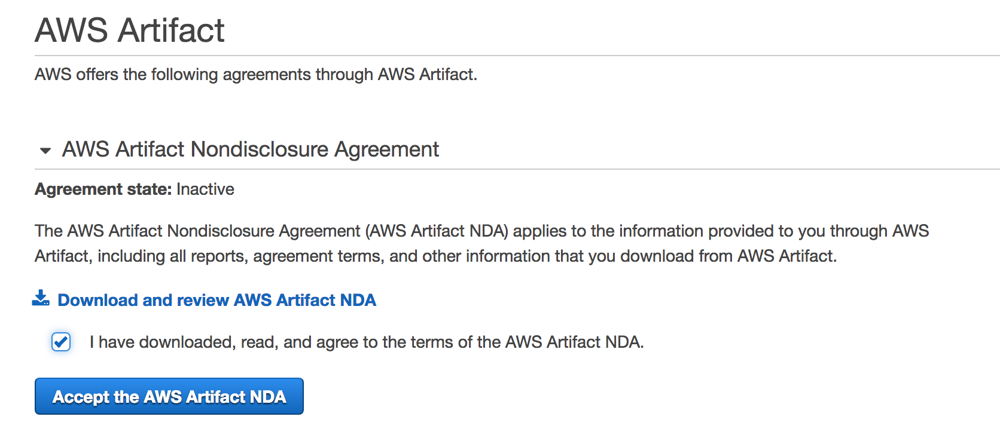
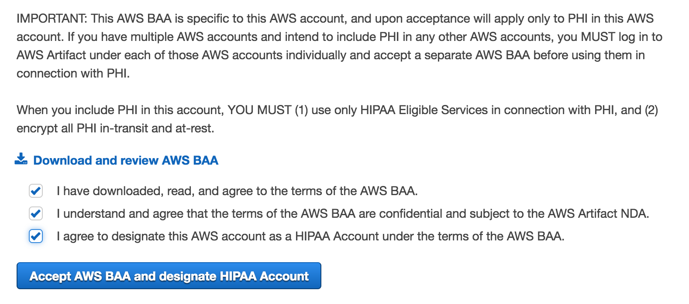
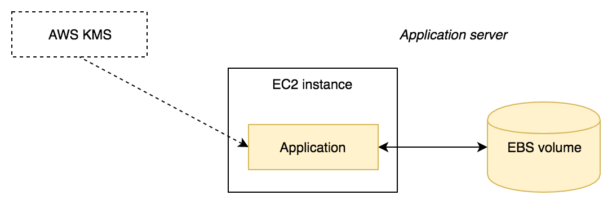

# Infrastructure as a Service (IaaS)

## Amazon Web Services

Subsections:
- [AWS Overview](#aws-overview)
- [AWS Shared Responsibility Model](#aws-shared-responsibility-model)
- [AWS BAA](#aws-baa)
- [AWS Security At Rest](#aws-security-at-rest)
- [AWS Security In Transit](#aws-security-in-transit)
- [AWS Network Security](#aws-network-security)

### AWS Overview

__Amazon Web Services (AWS)__ is a secure cloud service provider. It offers vast 
selection of services including computing power, storage, content delivery and 
others to help businesses scale and grow efficiently. 

AWS is [HIPAA compliant](https://aws.amazon.com/compliance/hipaa-compliance/) 
and can be used to process, store and transmit ePHI. This however apply certain 
restrictions on used services and requires specific measures aimed to secure 
your infrastucture. Usage of AWS _does not automatically make your cloud 
infrastructure HIPAA compliant_.

AWS offers subset of their services as __HIPAA eligible__. Usage of other 
services outside of this list is not allowed. Full list is available on their 
[HIPAA Eligible Services 
Reference](https://aws.amazon.com/compliance/hipaa-eligible-services-reference/) 
page. This list is changing over time as AWS adds HIPAA eligibility for more 
services, check AWS reference page to get latest details. 

Currently (at the time of writing) following services are HIPAA eligible:
- Amazon API Gateway excluding the use of Amazon API Gateway caching
- Amazon Aurora [MySQL-compatible edition only]
- Amazon CloudFront [excluding Lambda@Edge]
- Amazon Cognito
- AWS Database Migration Service
- AWS Direct Connect
- AWS Directory Services excluding Simple AD and AD Connector
- Amazon DynamoDB
- Amazon EC2 Container Service (ECS)
- Amazon EC2 Systems Manager
- Amazon Elastic Block Store (Amazon EBS)
- Amazon Elastic Compute Cloud (Amazon EC2)
- Elastic Load Balancing
- Amazon Elastic MapReduce (Amazon EMR)
- Amazon Glacier
- Amazon Inspector
- Amazon Redshift
- Amazon Relational Database Service (Amazon RDS) [MySQL, Oracle, and PostgreSQL 
  engines only]
- AWS Shield [Standard and Advanced]
- Amazon Simple Notification Service (SNS)
- Amazon Simple Queue Service (SQS)
- Amazon Simple Storage Service (Amazon S3) [including S3 Transfer Acceleration]
- AWS Snowball
- Amazon Virtual Private Cloud (VPC)
- AWS Web Application Firewall (WAF)
- Amazon WorkDocs
- Amazon WorkSpaces

_Business Associate Agreement (BAA)_, or _Business Associate Addendum_ (as AWS 
reference it) need to be signed before you can start usage of AWS for your HIPAA 
compliant workloads.

AWS implements _shared responsibility model_ where AWS manages security "of the 
cloud" and leave security "in the cloud" to be managed by the customer.

AWS offers a HIPAA-focused Whitepaper [Architecting for HIPAA Security and 
Compliance on Amazon Web 
Services](https://d0.awsstatic.com/whitepapers/compliance/AWS_HIPAA_Compliance_Whitepaper.pdf):
it has good overview of all HIPAA eligible services and explains how they can be 
used for building systems processing health information.

As a summary, here is a list of __steps to HIPAA compliant AWS infrastructure__:
1. Understand _shared responsibility model_
1. Sign _BAA (Business Associate Addendum)_
1. Use _HIPAA eligible services_ to build your infrastructure
1. Make sure your AWS services _configuration is HIPAA compliant_ (this is 
   customer's part of the shared responsity model) 

### AWS Shared Responsibility Model

AWS implements _shared responsibility model_ where AWS manages security "of the 
cloud" and leaves security "in the cloud" to be managed by the customer. It 
means there are two categories of security measures applied.

- __Security of the cloud:__ security measures that the cloud service provider 
  (AWS) implements and operates

- __Security in the cloud:__ security measures that the customer implements and 
  operates, related to the security of customer content and applications that 
  make use of AWS services

Basically AWS provides infrastrucuture for your applications that _can be used 
in HIPAA compliant way_. But it's your (AWS customer) responsibility to 
_configure cloud infrastructure_ to ensure confidentiality, integrity and 
availability of ePHI. You are also responsible for security of the 
application(s) deployed on top of this HIPAA compliant cloud infrastructure.

Following diagram demostrates this partitioning of responsibility.

AWS as a cloud service provider manages _physical security_ of the following 
components.

- Regions and availability zones
- Edge locations
- Compute resources
- Storage resources
- Databases
- Networks

You as a _customer manage security_ of the following areas.

- Network traffic protection
- Server-side encryption (for storage and databases)
- Data transmission integrity and encryption 
- Data availability
- Disaster recovery
- Access management

All these areas are typically covered by the cloud service provider (AWS) 
offerings but require proper _cloud architecture and configuration_ to be 
implemented by the customer.

Additionally you are responsible for security of components deployed on top of 
your AWS cloud infrastructure.

- Operating systems
- Platforms
- Applications

Understanding of the _shared responsibility model_ is an important step towards 
running your HIPAA application in AWS cloud. You can clearly see the boundaries 
of AWS offering in terms of security and plan your cloud architecture 
accordingly.

### AWS BAA

AWS requires _Business Associate Addendum (BAA)_ to be signed before you can 
start usage of AWS for your HIPAA compliant workloads.

AWS offers [AWS Artifact service](https://aws.amazon.com/artifact/) as 
self-service portal for on-demand access to security compliance reports and 
agreement (only BAA and NDA for now).

__Step 1:__ Accept AWS Artifact NDA.

- Sign in and open _AWS Artifact_ console
- Open _Agreements_ section
- Open _AWS Artifact Nondisclosure Agreement_ subsection
- Click on _Download and review AWS Artifact NDA_ link and read NDA
- Check "I have downloaded, read and agree ..." box
- Click on "Accept ..." button

Final state before clicking the button is shown on the picture below.

__Step 2:__ Accept AWS BAA.

- Open _AWS Business Associate Addendum_ subsection
- Click on _Download and review AWS BAA_ link and review BAA
- Check all 3 boxes
- Click on "Accept ..." button

Final state before clicking the button is shown on the picture below.

Now you can __start usage of your AWS account for HIPAA compliant workloads__. 
AWS requires that when you include PHI in this account, YOU MUST:

1. Use only HIPAA Eligible Services in connection with PHI, and
1. Encrypt all PHI in-transit and at-rest.

This does not restrict usage of this AWS account for data and application not 
covered by HIPAA requirements. However this usually requires specific cloud 
architecture where PHI is strictly separated from non-PHI resources.

AWS BAA can be _terminated at any time_ using AWS Artifact service. This means 
you have to delete all PHI under this account prior to termination, and stop 
further usage of this account in connection with any PHI.

### AWS Security At Rest

AWS requires customers to _encrypt PHI stored using HIPAA eligible services_. 
Encryption guarantees that data will be unusable to unauthorized individuals in 
case of storage breach (like physical access to a disk with PHI).  Assuming 
decryption key was not breached.

Data encryption in the storage ("at-rest") can be implemented using the 
following appoaches (or combination in some cases).

- __SSE (server-side encryption)__: mechanism provided by AWS services, uses 
  AES-256 GCM algorithm. The easiest way to utilize storage encryption on AWS 
  platform.
- __Application level encryption__: implemented using application framework or 
  by intergating third-party solutions. Gives more flexibility in terms of 
  authorization model and encryption algorithms.

[AWS Key Management Service (AWS KMS)](https://aws.amazon.com/kms/) is a managed 
service that makes it easy to manage and control encryption keys used to encrypt 
your PHI. It's integrated with other AWS services that provide SSE capabilities. 
Also you can use it as a centralized key store for all your applications.

_AWS KMS does not need to be HIPAA eligible service_ if it's used to manage keys 
for applications running on top of other HIPAA eligible services. Essentially 
PHI never reaches AWS KMS service itself because it stores only encryption keys.
However AWS KMS has strong security and quality controls, built-in highly 
availability, durability and scalability. Therefore _AWS KMS is highly 
recommended_ for deployments having HIPAA security compliance requirements.

__SSE (server-side encryption) using AWS KMS__ outlined on the following 
diagram:

Yellow color means that data stored there will be encrypted. _AWS KMS_ is used 
for encryption keys generation and distribution to services. Currently SSE 
(server-side encryption) available for:

- Amazon Elastic Block Store (Amazon EBS)
- Amazon Simple Storage Service (Amazon S3)
- Amazon Glacier
- Amazon Simple Queue Service (SQS)
- Amazon Relational Database Service (Amazon RDS) [MySQL, Oracle, PostgreSQL]
- Amazon Aurora
- Amazon DynamoDB
- Amazon Redshift
- Amazon Elastic MapReduce (Amazon EMR)
- AWS Snowball
- AWS Directory Services
- Amazon WorkDocs
- Amazon WorkSpaces

__Application level encryption using AWS KMS__ outlined on the following 
diagram:

Again yellow color shows where data will be encrypted. In this scenario 
application uses _AWS KMS_ to get encryption key and performs encryption. Then 
encrypted data is sent to _EBS volume_ for storage. Here standard encryption 
available for EBS (and other services) may not be used because data is already 
unreadable upon leaving the application.

Application level encryption requires more effort if compared to standard SSE 
implementation. But it has more flexibility, for example you may want to have 
encryption performed for each user of your application using separate keys. If 
this level of granularity is not required, then standard SSE provided by AWS 
will be enough.

### AWS Security In Transit

All PHI transferred through _network connections_ ("in-transit") _must be 
encrypted_. This applies to all types of connections to/from processing or 
storage resources involved into dealing with PHI. Encryption methods, 
configurtions and procedures are different for various connection types and 
architectures.

Typical AWS deployment has two types of data transfer paths (or connections): 
external and internal.

- __External data transfer__: from the customer (real user or other software if 
  your application has an API) to AWS infrastructure. In this case PHI is 
  transferred through multiple networks from the customer location to AWS data 
  center. These networks are controlled by third-party providers that's why 
  unencrypted transfer of PHI is highly unsafe.

- __Internal data transfer__: happens between AWS services. This is happening 
  inside the network controlled by AWS. Depending on your infrastructure PHI can 
  be transferred within availability zone, between availability zones or between 
  data centers. Even though PHI is not leaving networks controlled by AWS these 
  networks are shared between multiple AWS's customers and can not be considered 
  highly secure.

Described AWS infrastructure (in a bit simplified form) is outlined on the 
following diagram.  Red arrow shows _external data transfer_, yellow arrows show 
_internal data transfer_.

__Consumer to ELB__ is an  _external data transfer_ path in this schema.
[Elastic Load Balancer](https://aws.amazon.com/elasticloadbalancing/) or ELB is 
the only Internet-facing component in this architecture. To protect the 
confidential PHI data your ELB must be configured to allow _only TLS encrypted 
communication_.

This requires a SSL/TLS certificate to be deployed at the ELB, this certificate 
must be signed by CA (certificate authority). You can use [AWS Certificate 
Manager](https://aws.amazon.com/certificate-manager/) which is free and 
integrated with various AWS services (including ELB), or you can use any other 
CA and then just upload a certificate.

ELB load balancer can be configured to use TCP pass-through mode, in this case 
your application servers should have a certificate and will be responsible for 
traffic encryption and decryption. See more about that in [ELB 
documentation](https://aws.amazon.com/documentation/elastic-load-balancing/).

Further explanation is for _internal data transfer_ paths.

__ELB to EC2.__ ELB forwards traffic to one or more EC2 instances which run your 
application and responsible for actual handling of your consumers' requests.  
Since external traffic is decrypted at ELB using CA signed certificate it must 
be _encrypted again_ before transmission to the EC2 instance(s).

This can be achieved using the following measures.

- Configure EC2 instance to accept connection through _TLS encrypted connection 
  only_ (for HTTPS use port 443).
- Generate and install _self-signed TLS/SSL certificate_ to the EC2 instance.  
  Details of this step heavily depend on used OS and software chosen to handle 
  requests on EC2 side.
- Point ELB to these _secured EC2 endpoints_.

__EC2 to EC2__. Your application servers may have a need to interact with other 
EC2 instances. For example, this is necessary if you use microservices design 
pattern to build your system. Another example (which does not fit into this 
simplified architecture but still often used) is a database cluster deployed 
over AWS EC2 nodes. Databases like Cassandra or MongoDB are not available as 
managed AWS services, so you'll have to use EC2 if you want to use them.

In either case interaction between EC2 instances must be allowed through _TLS 
encrypted connections only_. If that's part of your application, then you need 
to use available frameworks to add encryption functionality. If you need it for 
other application (like database cluster), then this software need to be 
configured to use TLS connections.

This usually requires a _self-signed TLS/SSL certificates_. Details of 
configuration and ceritificate(s) deployment depend on the application or 
framework used for handling these connections.

__EC2 to AWS services (RDS, S3, SQS, etc).__ Most likely your application 
utilizes one or more AWS services. We are not covering details of each service 
here but typically application's needs fall into one of the following 
categories:
- database,
- file storage,
- message queue.

For all these services you must ensure that _only encrypted connection_ is used 
to transfer PHI to/from AWS service. This can be achieved by usage of:
- HTTPS endpoints if there is an API, or
- TLS based encrypted network connection.

These recommendations cover the typical AWS infrastructure, it can be different 
for your application but basic principles of handling PHI in-trasit remain the 
same.

### AWS Network Security

[AWS Virtual Private Cloud (VPC)](https://aws.amazon.com/vpc/) is the networking 
layer for AWS cloud infrastructure. It enables you to deploy AWS resources into 
a virtual network that you've defined. This virtual network closely resembles 
traditional network that you'd operate in a data center. However AWS network
uses [Software Defined Network 
(SDN)](https://en.wikipedia.org/wiki/Software-defined_networking) technology.  
This approach allows you to initialize and manage scalable AWS network 
infrastructure dynamically via API or using other software interfaces and tools.

VPCs are created using following main building blocks (this is not a complete 
list, see [VPC 
documentation](http://docs.aws.amazon.com/AmazonVPC/latest/UserGuide/VPC_Introduction.html) 
for more details).

- __Subnet__: this is a range of IP addresses in your VPC. Subnet has a _route 
  table_ and _security policies_ associated with the subnet that allow change of 
  network behavior of resources placed into subnet according to specific needs.

- __Internet Gateway__: enables resources inside the VPC to connect to the 
  Internet.  This behavior is configured through _subnet route tables_.  Subnet 
  that allows traffic flow to/from Internet Gateway is a _public subnet_, 
  otherwise it is a _private subnet_.

- __NAT Gateway__: allows connections from resources inside VPC to the Internet, 
  but prevents unsolicited inbound connections to protected resources. Must be 
  used by _private subnets_ as a method of accessing the Internet, if that's 
  necessary.

- __Network ACL__: act as a firewall for associated subnets, controlling both 
  inbound and outbound traffic at the subnet level.

- __Security Group__: act as a firewall for associated resources, controlling 
  both inbound and outbound traffic at the instance level.

Each modern AWS account has a _default VPC_, also customers can create 
additional _nondefault or custom VPCs_. For HIPAA compliant workloads usage of 
default VPC is not recommended. You have to __create custom VPC__ is order to 
make your network more secure by configuring and controlling it top-to-bottom.

AWS VPC supports _multiple network configuration scenarios_. If you want to 
design cloud network architecture optimized for your system and organization 
needs, then it makes sense to use help of professionals. In this guide we'll 
outline one possible scenario suitable for _public-facing web applications or 
APIs_ that use multi-tier software architecture.

Some comments about this scenario.

- _Public subnet_: used for resource that require direct connection to/from the 
  Internet
- _Private subnet_: used for application and database resources, they must be 
  protected and can not access the Internet directly
- _IGW (Internet Gateway)_: entry point for the Internet traffic
- _ELB (Elastic Load Balancer)_: receives incoming requests and forward them to 
  app/web server(s) 
- _NAT (NAT Gateway)_: allows resources in private subnet access the Internet
- _AZ1, AZ2_: shows different Availability Zones, the same subnets need to be 
  replicated across AZs to improve appications availability

This architecture requires additional component that allow you perform various 
_administrative tasks_ on your resources such as server configuration, 
maintenance and software upgrades. Depending on your organization need choose on 
of recommended approaches.

- __AWS Hardware VPN__: create an IPsec, hardware VPN connection between your 
  VPC and your remote network. In this case AWS VPC becomes an extension of 
  existing organization framework.
- __Software VPN (OpenVPN)__: create a VPN connection by using an Amazon EC2 
  instance in your VPC that's running a software VPN appliance.  
  [OpenVPN](https://openvpn.net/) is a commonly used package that provide VPN 
  functionality. This approach allows to access VPC from any computer assuming 
  it has properly configured OpenVPN client software.

_Network monitoring and audit_ can be performed using [VPC Flow 
Logs](http://docs.aws.amazon.com/AmazonVPC/latest/UserGuide/flow-logs.html) 
feature. It enables you to capture information about the IP traffic going to and 
from network interfaces in your VPC. Flow log data is stored using Amazon 
CloudWatch Logs.

### AWS Availability

_Coming soon..._

### AWS Backups and Disaster Recovery

_Coming soon..._

### AWS Access Management

_Coming soon..._

## Google Cloud Platform

_Coming soon..._

## Microsoft Azure

_Coming soon..._
